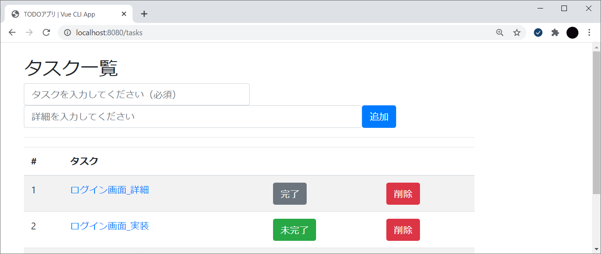

# Vue.js開発演習

## 1 はじめに

todo_appフォルダを作成し、次の仕様に従いTODOアプリケーションを構築してください。

- タスク一覧表示機能（サンプルコードあり）
- タスク詳細表示機能（サンプルコードあり）
- タスク登録機能
- タスク更新機能
- タスク削除機能

なお、以下のライブラリをインストールして開発を進めてください。

- Vue Router（ルーティング）
- Vuex（状態管理）
- Vue Head（head要素の管理）

```xml
npm init -y
npm install vue-router vuex vue-head
```

<br>

## 2 機能仕様

### 2.1 タスク一覧表示

#### 機能概要

- すべてのタスク情報を一覧表示します。
- 完了フラグ(DONE)が「1」の場合はグレー色で[完了]ボタンを、それ以外の場合は緑色で[未完了]ボタンを表示します。

<br>

#### 画面イメージ


<br>

#### プログラム

**main.js**

```js
import Vue from 'vue';
import App from './App.vue';
import store from './store.js';
import router from './router.js';
import VueHead from 'vue-head';   // Vue.jsでhead要素を管理するライブラリ

Vue.use(VueHead);

new Vue({
  el: '#app',
  store,
  router,
  components: { App },
  head: {
    title() {
      return {
        inner: 'TODOアプリ'
      }
    },
    meta: [
      { hid: 'description', name: 'description', content: 'タスク管理をするためのTODOアプリケーションです。' }
    ],
    link: [
      {
        // Vue.jsのUIライブラリとしてVuetifyやBootstrap Vueなどがありますが、
        // 研修範囲外のためCDNでBootstrapを読み込んで使用することとします。
        rel: 'stylesheet',
        href: 'https://stackpath.bootstrapcdn.com/bootstrap/4.3.1/css/bootstrap.min.css'
      }
    ]
  },
  render: h => h(App)
});
```

**App.vue**

```js
<template>
  <div class="container">
    <router-view></router-view>
  </div>
</template>
```

**List.vue**　<span style="color:red">※???の部分を埋めて完成させてください。</span>

```js
<template>
  <div class="row">
    <div class="col-10 pt-4">
      <h2>タスク一覧</h2>
      <form class="form-inline">
        <input type="text" class="form-control w-50" maxlength="30" 
               placeholder="タスクを入力してください（必須）" required><br>
        <input type="text" class="form-control w-75" maxlength="100"
               placeholder="詳細を入力してください">
        <button type="submit" class="btn btn-primary">追加</button>
      </form>
      <hr>
      <table class="table table-striped">
        <thead>
          <tr>
            <th>#</th>
            <th>タスク</th>
            <th></th>
            <th></th>
          </tr>
        </thead>
        <tbody>
          <tr v-for="task in tasks" :key="task.id">
            <td>{{ task.id }}</td>
            <td>{{ task.task }}</td>
            <td ???><button type="button" class="btn btn-secondary">完了</button></td>
            <td ???><button type="button" class="btn btn-success">未完了</button></td>
            <td><button type="button" class="btn btn-danger">削除</button></td>
          </tr>
        </tbody>
      </table>
    </div>
  </div>
</template>

<script>
export default {
  data() {
    return {
      tasks: [],
      task: '',
      detail: ''
    }
  },
  mounted() {
    // Vueインスタンスのマウント直後にストアからタスクデータを取得する
    this.tasks = this.$store.state.tasks;
  }
}
</script>
```

<br>
<hr>

### 2.2 タスク詳細表示

#### 機能概要

- タスク一覧の[タスク]リンクをクリックすることで個別ページを表示します。

<br>

#### 画面イメージ




<br>

#### プログラム

**Edit.vue**　<span style="color:red">※???の部分を埋めて完成させてください。</span>

```js
<template>
  <div class="row">
    <div class="col-10 pt-4">
      <h2>タスク詳細</h2>
      <table class="table">
        <tr>
          <th>ID</th>
          <td>{{ task.id }}</td>
        </tr>
        <tr>
          <th>タスク</th>
          <td>{{ task.task }}</td>
        </tr>
        <tr>
          <th>詳細</th>
          <td>{{ task.detail }}</td>
        </tr>
        <tr>
          <th>状況</th>
          <td>{{ task.done===0 ? '未完了' : '完了' }}</td>
        </tr>
      </table>
      <router-link to="/tasks">一覧へ</router-link>
    </div>
  </div>
</template>

<script>
export default {
  ???
}
</script>
```

<br>
<hr>

### 2.3 タスク登録機能

#### 機能概要

- タスク一覧画面の[タスク]テキストボックス、[詳細]テキストボックスに値を入力し、[追加]ボタン押下またはEnterキー押下でタスクテーブルにデータを新規登録します。
- 登録処理後、最新のタスクデータで一覧表示し直します。
- 登録処理後、各テキストボックスの値をクリアします。

<br>

#### 画面イメージ

- タスク登録前


- タスク登録後


<br>
<hr>

### 2.4 タスク更新機能

#### 機能概要

- タスク一覧画面の[完了]ボタンまたは[未完了]ボタンを押下することで、対象のタスクデータの完了フラグを更新します（完了フラグを反転して更新します）。
- 更新処理後、最新のタスクデータで一覧表示し直します。

<br>

#### 画面イメージ

- タスク更新前


- タスク更新後（ID:2のタスクを更新）


<br>
<hr>

### 2.5 タスク削除機能

#### 機能概要

- タスク一覧画面の[削除]ボタンを押下することで、対象のタスクデータを物理削除します。
- 削除処理後、最新のタスクデータで一覧表示し直します。

<br>

#### 画面イメージ

- タスク削除前


- タスク削除後（ID:4のタスクを削除）


